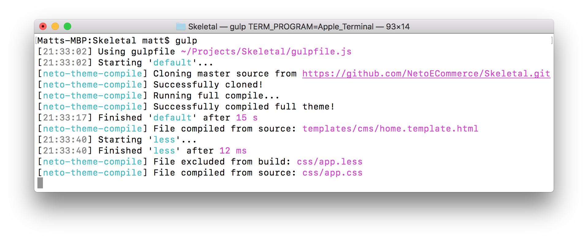

# neto-theme-compile


## Usage

### `npm install neto-theme-compile`

### Gulp
In your `gulpfile.js`, simply import and call the `gulpWatchAndCompile()` method like so:
```javascript
const gulp = require('gulp');
const { gulpWatchAndCompile } = require('neto-theme-compile');

gulp.task('default', function() {
    return gulpWatchAndCompile();
});
```

### API
You can also use the library programmatically, as seen below:
```javascript
const { NetoThemeCompiler } = require('neto-theme-compile');
let themeCompiler;

themeCompiler = new NetoThemeCompiler();
themeCompiler.init()
    .then(() => themeCompiler.compileFull())
    .then(() => console.log('Done!'))
    .catch((err) => console.error(err))
```

### TODO
- [ ] Rename the style.css and netothemeinfo.txt correctly
- [ ] Handle case when git is not installed